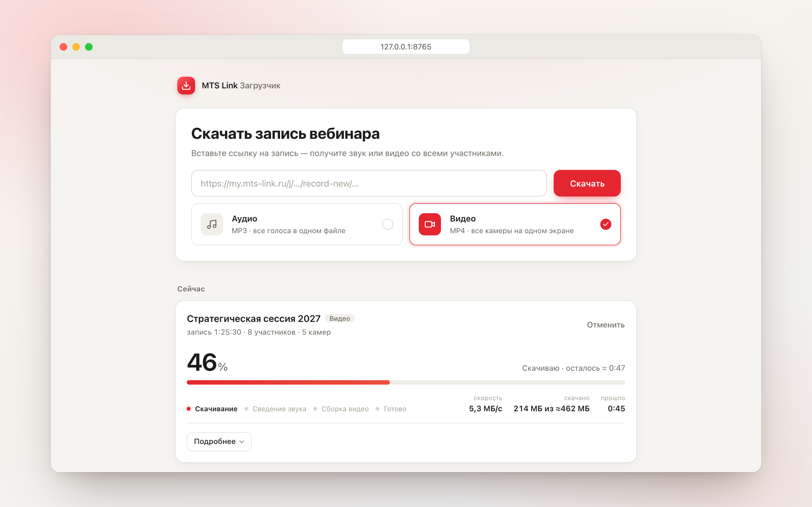
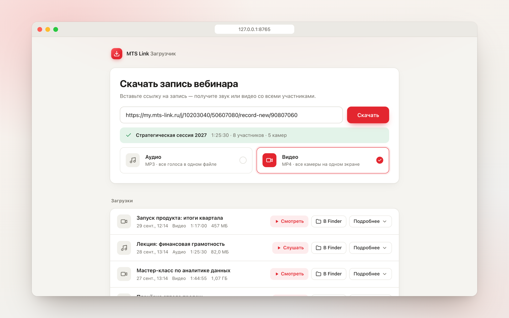
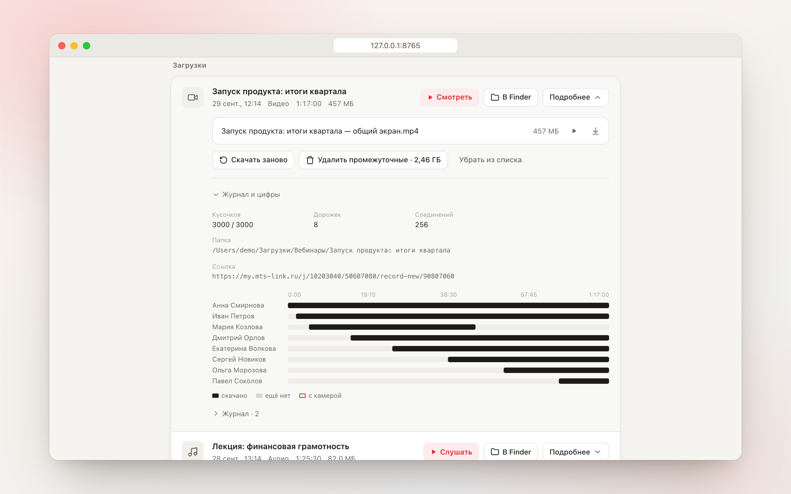
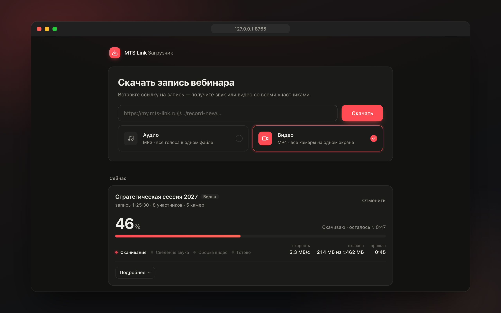
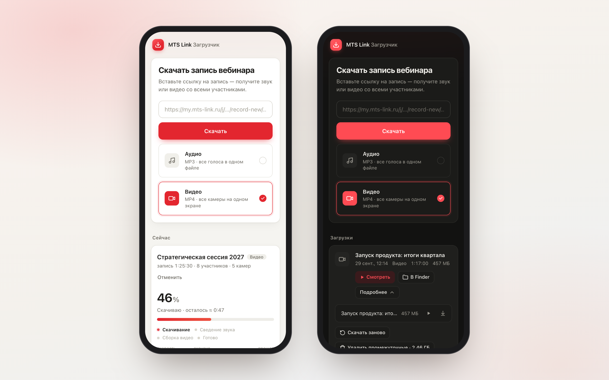

# MTS Link Загрузчик

Скачивает запись вебинара MTS Link по ссылке: **звук** всех участников одним MP3 или **видео** — все камеры на одном экране, со звуком. Работает локально на Mac: дашборд в браузере или команда в терминале.



| Вставил ссылку — видно, что за запись | Подробнее — участники на шкале |
|---|---|
|  |  |
| **Тёмная тема** | **На телефоне** |
|  |  |

Только для записей, к которым у вас есть права.

## Что нужно

- macOS (Apple Silicon или Intel)
- [Homebrew](https://brew.sh)
- `ffmpeg` и Python 3.10+ — ставятся одной командой ниже
- Git — есть в macOS (при первом вызове предложит поставить Command Line Tools)

## Установка

```bash
# 1. ffmpeg и Python
brew install ffmpeg python@3.12

# 2. проект
git clone https://github.com/nilysenok/webinar-downloader.git
cd webinar-downloader
```

Дальше ничего ставить руками не нужно: при первом запуске `start.command` сам создаст окружение `.venv` и поставит зависимости из `requirements.txt`.

Если нужно поставить вручную (например, без Finder):

```bash
python3.12 -m venv .venv
.venv/bin/pip install -r requirements.txt
```

## Запуск

Двойной клик по **`start.command`** в Finder (или `./start.command` в терминале). Откроется окно Терминала с сервером и дашборд в браузере: <http://127.0.0.1:8765>.

1. Вставьте ссылку на запись вида `https://my.mts-link.ru/j/…/record-new/…` — под полем появится название, длительность и сколько участников и камер.
2. Выберите **Аудио** (MP3) или **Видео** (MP4, все камеры на одном экране).
3. Нажмите **Скачать**. Готовый файл — кнопкой «▶ Смотреть» / «▶ Слушать» или «В Finder».

Окно Терминала с сервером не закрывайте, пока идут загрузки: закроете — сервер остановится. Mac не уснёт, пока идёт загрузка.

Файлы складываются в `downloads/ГГГГ-ММ-ДД_ЧЧММ <название>/`. Промежуточные куски — в `_work/` внутри той же папки; они нужны для докачки после обрыва и удаляются кнопкой «Удалить промежуточные» в «Подробнее».

## Из терминала

```bash
# звук одним MP3
.venv/bin/python -m downloader.cli "https://my.mts-link.ru/j/…/record-new/…" --mode audio

# видео: один MP4 «общий экран» со звуком
.venv/bin/python -m downloader.cli "<ссылка>" --mode av

# видео каждой камеры отдельными файлами вместо общего экрана
.venv/bin/python -m downloader.cli "<ссылка>" --mode av --no-gallery
```

Параметры: `--mode audio|av|video`, `--quality best|480`, `--workers 64` (до 256), `--no-gallery`.

Длинные загрузки удобнее запускать через `scripts/download.sh` — те же параметры, но Mac не уснёт до конца:

```bash
scripts/download.sh "<ссылка>" --mode audio
```

## Обновление

```bash
git pull
```

Затем перезапустите `start.command` и обновите страницу в браузере. Если зависимости поменялись, `start.command` доставит их сам.

## Если что-то не так

| Что видно | Что сделать |
|---|---|
| В дашборде «Failed to fetch» | Сервер не запущен — запустите `start.command` и не закрывайте его окно |
| «Не найден ffmpeg» | `brew install ffmpeg` |
| «Не найден рабочий Python 3.10+» | `brew install python@3.12` |
| Загрузка оборвалась | «Продолжить» в строке загрузки — докачает с места остановки |
| Интерфейс выглядит странно после обновления | Обновите страницу с Cmd+Shift+R |
| Отдельные видео камер не открываются в QuickTime | Это VP9 — откройте в Chrome, VLC или IINA; «общий экран» (H.264) открывается везде |

## webinarip — быстрая версия на Rust

Отдельная открытая программа того же автора: один файл без Python, звук за секунды, видео участников, таймлайн для монтажа. Репозиторий: <https://github.com/nilysenok/webinarip>.

```bash
curl --proto '=https' --tlsv1.2 -LsSf https://github.com/nilysenok/webinarip/releases/latest/download/webinarip-installer.sh | sh
webinarip "<ссылка>"            # звук
webinarip "<ссылка>" --video    # видео участников
webinarip serve                 # веб-интерфейс
```

## Распознавание речи (по желанию)

Для экспериментов со стенограммой — отдельное окружение `.venv-asr` и модели Whisper (~2 ГБ в `~/.cache`):

```bash
scripts/asr/setup.sh
```

Для обычной загрузки звука и видео не нужно.

## Разработка

```bash
.venv/bin/python -m unittest discover -s tests   # тесты
.venv/bin/python xtask.py --check                # тесты + проверка документации
.venv/bin/python xtask.py                        # пересобрать ROOT.md и dashboard.html
```

Устройство проекта описано в md-файлах рядом с кодом: `pravila.md` — правила работы, `spec.md` — словарь и лимиты, `<модуль>/_ctx.md` — всё о модуле, `ROOT.md` и `dashboard.html` — сводка (собирается `xtask.py`, руками не правится). Модули: `downloader/` — загрузка и сборка файлов, `server/` — сервер дашборда, `ui/` — интерфейс, `scripts/` — запуск и окружение.

## Автор и лицензия

Nikita Lysenok · [MIT](LICENSE)
